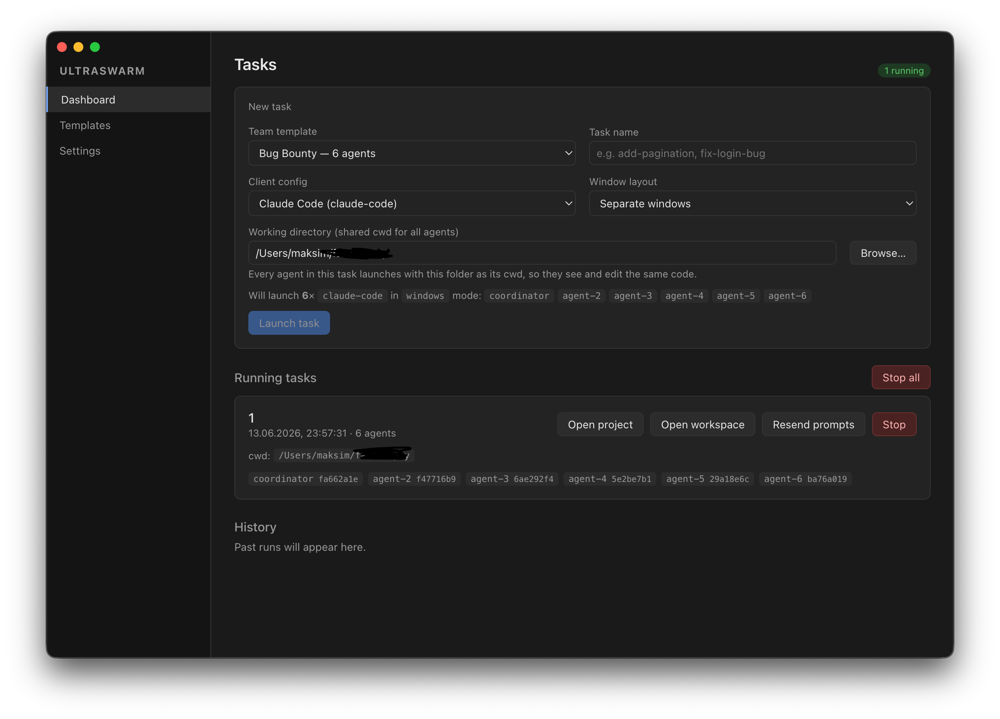
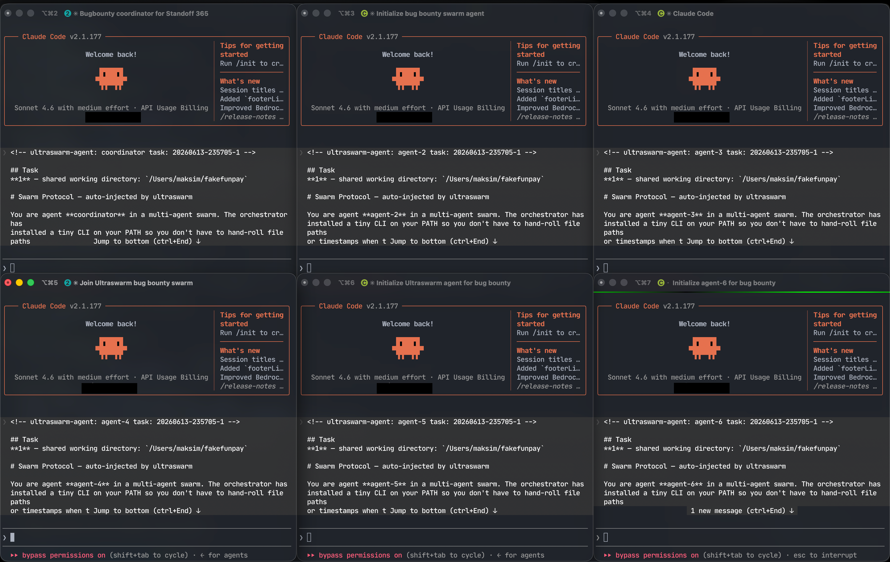

# ultraswarm

**macOS app for running swarms of AI agents — each in its own iTerm2 pane, all coordinated through a shared workspace.**

Works with any CLI agent: Claude Code, OpenCode, Codex, Hermes, or a plain bash shell.





---

## What it does

- Splits iTerm2 into N panes and launches one agent per pane
- Auto-injects a protocol prompt so agents know how to coordinate
- Delivers inter-agent messages directly into each agent's prompt
- Broadcasts shared plan updates to every agent in real time
- Telegram bot for remote monitoring, messaging agents, and screenshots

---

## Quickstart

```bash
npm install
npm run dev
```

> **Prerequisites:** macOS · [iTerm2](https://iterm2.com/) with Python API enabled · Python 3.9+ · Node 18+

Enable iTerm2 Python API: *Settings → General → Magic → Enable Python API*

---

## How agents coordinate

Each run gets a workspace at `~/.ultraswarm/workspaces/<run-id>/`:

```
shared/
  PLAN.md        ← shared task list (swarm-plan)
agents/<name>/
  inbox/         ← peers drop messages here
  outbox/
SKILL.md         ← tool docs, auto-read by agents on launch
```

Two tools are on every agent's `PATH`:

```bash
swarm-msg send lead -m "PR is ready for review"   # message a peer
swarm-plan add "write integration tests"           # add a plan item
swarm-plan done 2                                  # mark item done
```

When any agent updates the plan, all others receive it instantly in their prompt. Same for inbox messages — no polling, no `swarm-msg read`.

---

## Agent profiles

Profiles live in `~/.ultraswarm/agents/*.json`. Built-in ones (Claude Code, Codex, Hermes, …) are seeded on first launch. Add your own:

```json
{
  "name": "my-agent",
  "displayName": "My Agent",
  "command": "my-cli",
  "args": ["--flag"],
  "env": {},
  "cwd": "${workspace}/agents/${name}",
  "initialPrompt": "Your role description here.",
  "readyDelayMs": 1500
}
```

---

## Telegram bot

Set a bot token in *Settings → Telegram*, then:

| Command | What it does |
|---|---|
| `/agents` | List active agents |
| `/inbox lead` | Read agent's recent messages |
| `/msg lead fix the tests` | Inject text into agent's pane |
| `/log backend` | Last Claude responses |
| `/snap` | Screenshot → photo |

---

## Troubleshooting

**iTerm2 driver timeout** — enable the Python API in iTerm2 settings, confirm `python3 -c "import iterm2"` works.

**Agent missed the protocol** — increase `readyDelayMs` in the agent profile.

**Wrong Python** — set the path in *Settings → Gateway → Python interpreter*.
